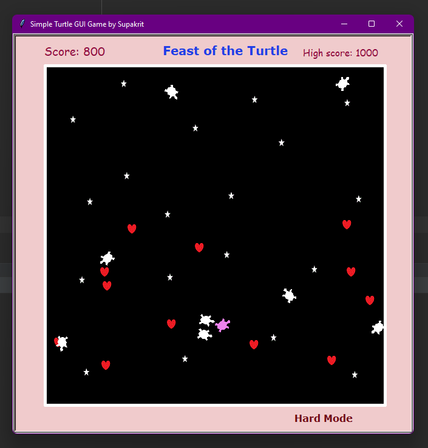

## Disclaimer! all the source code are in 'project source code forder'

# Feast of Turtle

## Overview and Features
The concept of this game is to eat moving items while avoiding moving obstacles
to gain the highest score possible. The user can control the direction 
that the turtle is moving using keyboard keys. The score is based on how
many items the turtle eats. This game will also include medium and hard modes. 
The number of obstacles and items will increase over time. Users can also view
the previous progress of the game by using view mode. 

## Modules and Program design

This project consists of seven modules.

### 1. Module `player.py`

This module contains the `Player` class which maintain Player object 
which movement can be controlled.
Player class is a subclass of Turtle class.
Initialize with name, colour, speed, is_alive, and score properties.

### 2. Module `item.py`

This module contains the `Item` class which maintain Item
object which move randomly.
Item class is a subclass of Turtle class.
Initialize with speed and position properties.

### 3. Module `obstacle.py`
This module contains the `Obstacle` class which maintain Obstacle
object which move randomly.
Obstacle class is a subclass of Turtle class.
Initialize with speed and position properties.

### 4. Module `border.py`
This module provides the `Border` class which maintain Border instance
with a rectangular shape.
Border class is a subclass of Turtle class.
Initialize with corner, width,and height properties.

### 5. Module `score.py`
This module provides the `Score` class which maintain Score 
object which can track your score and save it.
Score class is a subclass of Turtle class.
Initialize with score property and old_high_score attribute.

### 6. Module `stage.py`
This module provides the `Stage` class which represent a stage 
for all objects such as border and a screen, as well
as a Player object, Item object, Obstacle objects.
Stage class is a subclass of Turtle class.
Stage class provides many important methods for the game.

###7. Module `app.py`
This module import all the previous module and some libraries(`json`, `time`, `math`
, `random`, `turtle`).
It provides a systematic application with a specific mode for user to user
like view mode and game mode.

## Required libraries and tools
Recommended using Python 3.8 onwards. However, I think python 3 onwards
should work fine.
### libraries
In this project, I have implemented these libraries: `json`, `time`, `math`
, `random`, `turtle`

##Code structure
There are totally 12 source files. 7 of them are source code file.
The rest of them are `game_data.json`, and 4 gif file.
